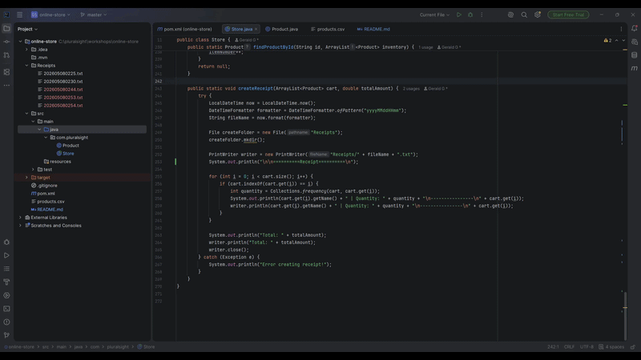

# Online Store

## Description of the Project

This is a Java console application that simulates an online store shopping experience. It is intended for customers 
who want to browse products, manage a shopping cart, and complete a purchase. The application allows users to view available 
products, search by product ID, add items to their cart, and checkout with payment processing. It aims to solve the problem 
of providing a simple and interactive shopping experience directly from the terminal, while also generating a receipt file 
saved locally for record keeping.
## User Stories

- As a customer I would like to see all my products to decide what to buy at the end
- As a customer I want to add products to my cart so I can look at them later
- As a customer I want to be able to see my cart so I can decide what to buy at checkout
- As a customer I want to be able to check out my items to go home with them
- As a Customer I would like to search up an item by ID to find my product faster
- As a customer I want to be able to add my items to cart but not one at a time I want them to add together to see it together
- As a customer I would like to see my receipt to see what I bought
## Setup

Instructions on how to set up and run the project using IntelliJ IDEA.

### Prerequisites

- IntelliJ IDEA: Ensure you have IntelliJ IDEA installed, which you can download from [here](https://www.jetbrains.com/idea/download/).
- Java SDK: Make sure Java SDK is installed and configured in IntelliJ.

### Running the Application in IntelliJ

Follow these steps to get your application running within IntelliJ IDEA:

1. Open IntelliJ IDEA.
2. Select "Open" and navigate to the directory where you cloned or downloaded the project.
3. After the project opens, wait for IntelliJ to index the files and set up the project.
4. Find the main class with the `public static void main(String[] args)` method.
5. Right-click on the file and select 'Run 'YourMainClassName.main()'' to start the application.

## Technologies Used

- Java: corretto-17 Amazon Corretto 17.0.18

## Demo

## Future Work

- Search improvements — Allow users to search by product name or price range, not just by ID
- Save cart — Allow users to save their cart and come back to it later
- Better receipt formatting — Improve the receipt layout with a header, store name, and cleaner spacing

## Resources

List resources such as tutorials, articles, or documentation that helped you during the project.

- [GitHub Resource](https://github.com/RayMaroun/yearup-spring-section-8-2026)
- [Java Visual](https://raymaroun.github.io/yearup-java-visuals/)

## Team Members

- **Gerald** - Owner

## Thanks

Express gratitude towards those who provided help, guidance, or resources:

- Thank you to Raymond for continuous support and guidance.
 